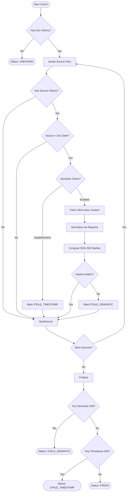

# Drift Detection

The core of DocGap is its ability to detect when documentation is out of sync with the underlying source code. This logic is encapsulated in the `checkDrift` function.

## Algorithm Overview

The drift detection process determines if a documentation file is out of sync with its source files. It uses a two-phase approach: a fast **Timestamp Check** followed by a deep **Semantic Hash Check**.

## Step-by-Step Logic

### 1. Timestamp Verification (Phase 1)
The process begins by establishing a baseline timeline.

1.  **Retrieve Documentation Timestamp (`t_doc`)**:
    We call `getEffectiveFileUpdate(docPath)`. This traverses the git history to find the last commit that modified the documentation file, identifying the "Last Known Good" state.
    *   *If no history is found*, we cannot establish a baseline. Status -> `UNKNOWN`.

2.  **Iterate Source Files**:
    For each source file linked in `.docgap.yaml`:
    *   **Retrieve Source Timestamp (`t_code`)**: We find the last relevant commit for the source file.
    *   **Comparison**: We compare the dates.
        *   If `t_code <= t_doc`: The source code hasn't changed since the doc was updated. File is **Fresh**.
        *   If `t_code > t_doc`: The source code is newer. This triggers **Phase 2**.

### 2. Semantic Hash Check (Phase 2)
If a file is newer, it doesn't necessarily mean the documentation is outdated. The change might be "noise" (whitespace, comments, formatting).

1.  **Strict Mode Check**:
    If `semantic.strict` is `true` in configuration, we skip analysis and immediately flag the file as drifted.

2.  **Fetch Content States**:
    *   **Current Content**: The file content as it exists on disk (or HEAD).
    *   **Baseline Content**: The content of the source file *at the exact commit* (`t_doc`) when the documentation was last updated.

3.  **Normalization (Repomix)**:
    Both versions of the content are passed through `normalizeViaRepomix`. This function uses the `repomix` library to strip "noise" while preserving logic.
    *   **Repomix Config**:
        *   `compress: true`: Minimizes structural whitespace.
        *   `removeComments: true`: Removes all comments, as they (usually) don't affect how the code works, only how it's explained.
        *   `removeEmptyLines`: Strips spacing changes.

4.  **Hashing**:
    We compute a `SHA-256` hash of the normalized strings.

5.  **Comparison**:
    *   **Match**: The structural code is identical. The "change" was likely a comment fix or prettier run. **Ignore Drift**.
    *   **Mismatch**: The code logic has changed. **Record `STALE_SEMANTIC`**.

### 3. Status Determination
After checking all source files, the final status for the documentation file is determined by priority:

1.  **`STALE_SEMANTIC`**: If *any* source file has a semantic mismatch, the documentation is semantically stale. This is the highest urgency.
2.  **`STALE_TIMESTAMP`**: If there are no semantic mismatches, but some files triggered a timestamp drift (and weren't cleared by semantic checks, or strict mode was on), it is timestamp stale.
3.  **`FRESH`**: If no source files are drifting.
